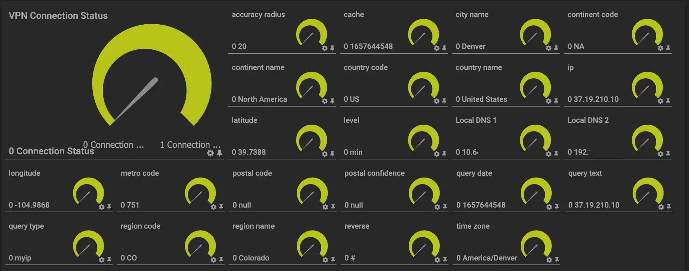

# PRTG DNS Monitoring

PRTG DNS Monitoring checks for DNS leaks or changes in operating system DNS servers.

 
<h3>External DNS Leak Check Monitors the following:</h3> 
<ul>
<li>country code</li>
<li>country name</li>
<li>region code</li>
<li>region name</li>
<li>continent code</li>
<li>continent name</li>
<li>city name</li>
<li>postal code</li>
<li>postal confidence</li>
<li>latitude</li>
<li>longitude</li>
<li>accuracy radius</li>
<li>time zone</li>
<li>metro code</li>
<li>cache</li>
<li>ip</li>
<li>reverse</li>
<li>query text</li>
<li>query type</li>
<li>query date</li>
</ul>
<h3>Local DNS Monitors: </h3>
<ul>
<li>Local OS DNS (all)</li>
<li>VPN Connection Status</li>
</ul>
 

### Installation

`npm i` 
`node dns.js`

### Test:

`curl localhost:3024/dns`
